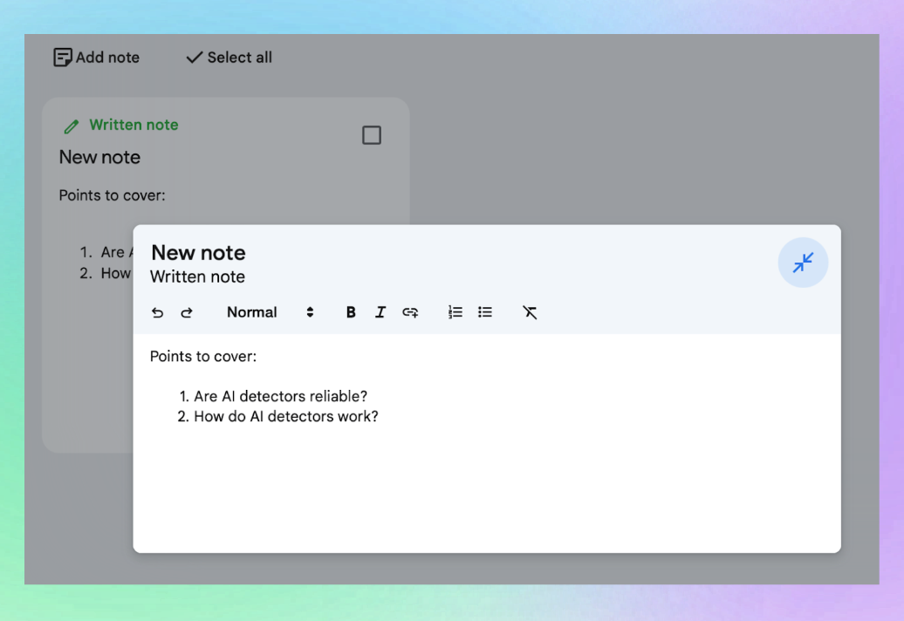
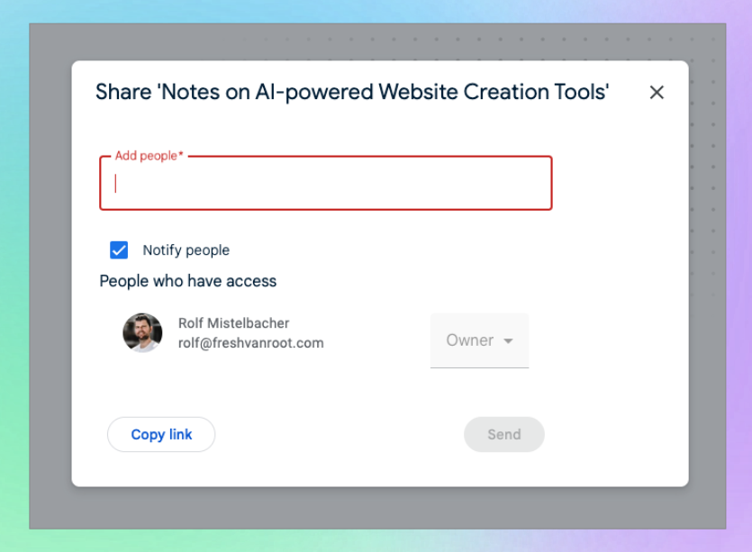

# Google NotebookLM
**Google NotebookLM**(https://notebooklm.google.com/) est un produit  développé par Google Labs. Il se concentre sur l'amélioration de la manière dont les utilisateurs interagissent avec leurs notes et documents en utilisant l'IA pour **extraire, résumer et travailler avec le contenu plus efficacement**. Plutôt que de simplement stocker des informations, NotebookLM permet aux utilisateurs de **interagir de manière plus significative avec leurs notes**. Cela facilite la recherche des points essentiels ou l'obtention d'un aperçu concis d'un document. Il est conçu pour toute personne souhaitant rationaliser son processus de prise de notes et d'analyse.

Il est décrit comme un **assistant de brainstorming alimenté par l'IA**. 

## Fonctionnalités principales

D'après les expérimentations, voici quelques fonctionnalités clés de NotebookLM :

*   **Téléchargement et interaction avec les documents** :
  
    
    *   Possibilité de télécharger des fichiers PDF, .txt, Markdown et audio.
    *   Les utilisateurs peuvent également ajouter des sources depuis Google Drive (Docs et Slides), pointer vers des sites web, une vidéo YouTube, ou coller du texte copié.
    *   La limite de ressources est de 50 éléments.
    *   Dès qu'un fichier est téléchargé, des options sont proposées, comme la création de versions audio ou la possibilité de discuter davantage.
    *   Le téléchargement de fichiers audio permet aux utilisateurs d'obtenir des transcriptions ou de comprendre un résumé.
    *   Les utilisateurs peuvent télécharger des fichiers puis discuter pour obtenir une analyse ou un résumé.
    

*   **Fonctionnalité audio générée par l'IA** :
  
    
    *   Permet la création d'une conversation audio sur vos fichiers.
    *   Cela va au-delà de la simple conversion texte-vers-audio.
    *   Elle crée une **conversation de type podcast entre deux voix générées par l'IA discutant du contenu** des documents téléchargés.
    *   Cette fonctionnalité est considérée comme plus dynamique et engageante que la narration à voix unique.
    *   Elle est utile pour les personnes qui souhaitent absorber des informations de manière plus interactive.
    *   Lors de la création de podcasts IA, les utilisateurs peuvent **personnaliser les instructions pour l'animateur du podcast et fournir des détails sur le public cible**.
    *   Les utilisateurs peuvent également **configurer ce sur quoi l'audio généré doit se concentrer**.

*   **Outils de recherche et de résumé** :
  
    *   Utilise l'IA pour créer des résumés rapides et mettre en évidence les points clés des documents.
    *   Aide les utilisateurs à trouver immédiatement les détails importants au lieu de lire des fichiers longs.
    *   Utile pour les étudiants qui ont besoin de faits clés, les créateurs de contenu qui cherchent des idées rapidement, ou les professionnels qui travaillent avec de nombreux documents.
    *   Facilite l'accès aux informations nécessaires rapidement.

*   **Création manuelle de notes** :
  
    
    *   Bien que l'utilisation principale soit l'interaction avec les sources téléchargées via l'IA, NotebookLM prend également en charge la création manuelle de notes.
    *   Cela ressemble à d'autres applications de prise de notes comme Google Keep, Notion ou Obsidian.
    *   Les utilisateurs peuvent créer et organiser des notes de manière indépendante.
    *   Cette fonctionnalité offre la flexibilité de noter des pensées, idées ou informations importantes.
    *   Cette fonctionnalité fonctionne de manière complémentaire avec les outils d'interaction avec les documents, offrant à la fois une gestion traditionnelle et améliorée des notes.

*   **Collaboration** :
  
    
    *   Les carnets de notes peuvent être partagés avec d'autres, comme le partage de fichiers sur Google Drive.
    *   Cela facilite la collaboration en équipe avec le soutien de l'IA au sein de l'outil.
    *   Un excellent moyen de co-créer, partager des idées et travailler plus efficacement.

## Comment commencer

**Pour accéder à NotebookLM, vous aurez besoin de** :

*   Un compte Google
*   Un navigateur web compatible (Chrome est recommandé)

**Comment s'inscrire et commencer** :

1.  Visitez la page Google  NotebookLM .
2.  Connectez-vous avec votre compte Google.
3.  Suivez les instructions .

